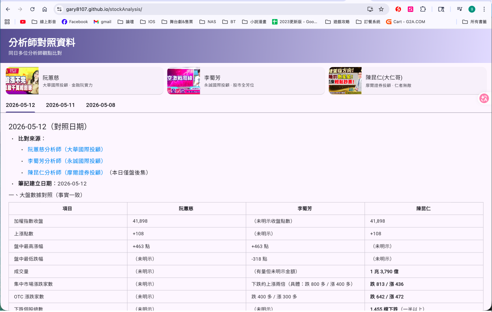
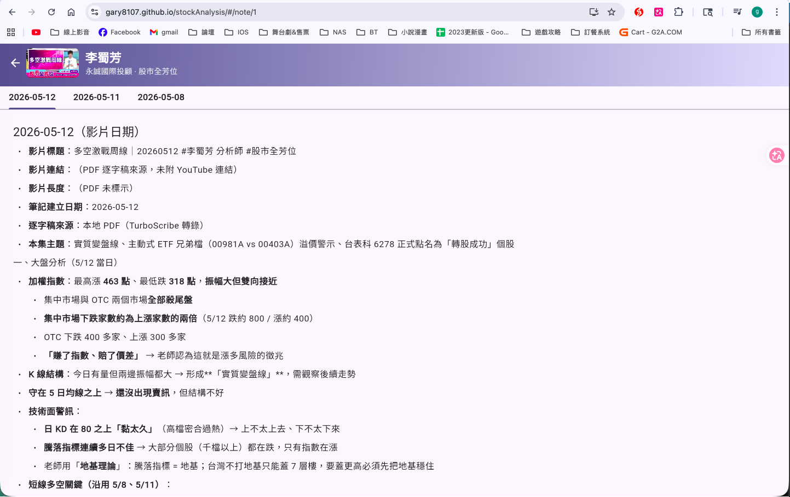

# 台股投顧分析師筆記檢視系統

> A Flutter Web application for browsing structured Taiwan stock analyst notes — a cross-platform learning project from iOS / Swift into Flutter Web, maintaining MVVM discipline.

[](https://flutter.dev)
[](https://dart.dev)
[](https://m3.material.io)
[](LICENSE)

把多位台股投顧分析師的 YouTube 影片重點，以結構化 markdown 形式累積、透過 Flutter Web 介面瀏覽、並支援跨分析師觀點對照。

> **重要聲明**：本專案所有筆記內容皆為個人對公開節目的整理與觀察，**並非投資建議**；所有提及個股皆**非推薦**，內容僅供研究與技術 portfolio 用途。

---

## 專案目標

這個專案有兩個並行目的：

1. **內容層**：把每天追蹤的台股投顧 YouTube 節目（阮蕙慈／李蜀芳／陳昆仁）做成可累積、可比對、可搜尋的個人筆記庫
2. **技術練習**：作為一個 iOS 工程師（Swift / Flutter）跨界到 **Flutter Web** 的學習作品，刻意保留 MVVM 架構紀律以驗證 SwiftUI → Flutter 的概念對應

---

## Live Demo

🚀 **<https://gary8107.github.io/stockAnalysis/>**

GitHub Actions 自動部署（`.github/workflows/deploy.yml`）：每次 push 到 `main` 會自動 `flutter build web --release` + 推上 GitHub Pages，約 3~5 分鐘上線。

---

## Screenshots

### 首頁 — 對照中心化版面

<p align="center">
  
</p>

漸層 Banner +「3 位分析師」卡片（YouTube 節目縮圖）+ 日期 TabBar + 跨分析師對照內容；切換日期 Tab 不重新載檔。

### 個別分析師頁

<p align="center">
  
</p>

點任一張分析師卡片進入個別頁面，沿用同樣的日期 Tab 結構切換不同日期；陳昆仁同日有「盤前 / 盤後」兩場時，Tab 自動展開成兩行副標。

---

## Tech Stack

| 層 | 套件 | 選擇理由 |
|---|---|---|
| **Framework** | Flutter 3.41 (Web) | Single codebase 跨 web / iOS / macOS；對 iOS 工程師而言概念對應最直觀 |
| **語言** | Dart 3.11 | Sound null safety、record、pattern matching 都到位 |
| **路由** | [`go_router`](https://pub.dev/packages/go_router) | 聲明式路由，類似 SwiftUI `NavigationStack` 的 mental model |
| **Markdown 渲染** | [`flutter_markdown`](https://pub.dev/packages/flutter_markdown) | 直接吃 .md 字串輸出 widget tree，支援表格、連結、程式碼區塊 |
| **State management** | [`provider`](https://pub.dev/packages/provider) | 跟 SwiftUI `@ObservedObject` 同個概念，學習曲線最平緩 |
| **UI System** | Material 3 + `ColorScheme.fromSeed` | 自動深淺色、動態色彩 |

---

## Features

- 列出 3 位分析師筆記檔 + 1 份跨分析師對照檔
- Markdown 渲染（含表格、引用、清單、連結、程式碼區塊）
- 跟系統的深淺色切換
- 可選取文字、複製貼上
- Web 友好的 URL 路由（每份筆記都有獨立 URL，可分享）

### Roadmap

| Phase | 範圍 | 狀態 |
|---|---|---|
| **0** | Flutter Web scaffold、4 份 markdown 渲染、首頁卡片 + 詳細頁 | ✅ Done |
| **1** | HomePage 對照中心化版面重設計 + NotePage 日期 Tab + 共用 widgets | ✅ Done |
| **2** | 引入 `provider` + ViewModel 層、把資料載入抽出 view、VM 單元測試 | ✅ Done |
| **3** | 全文搜尋（個股代號、關鍵字）、跨分析師個股索引 | Next |
| **4** | 共識度 timeline、日期 calendar 視圖 | Planned |
| **5** | GitHub Pages 部署、CI/CD（GitHub Actions） | ✅ Done |

---

## Architecture

採 **MVVM** 分層，對應 SwiftUI 開發習慣：

```
┌──────────────────────────────────────────────────────────────┐
│  main.dart   ─── MultiProvider 注入 stateless services       │
│       ↓                                                       │
│  View         (StatelessWidget + 頁面層 ChangeNotifierProvider)│
│       ↓ Consumer 訂閱 state (idle/loading/success/error)      │
│  ViewModel   (HomeViewModel / NoteViewModel : ChangeNotifier) │
│       ↓ context.read<Service>() 取得依賴                       │
│  Service     (MarkdownLoader / MarkdownSectionParser)         │
│       ↓ 讀取                                                   │
│  Asset bundle (markdown 檔案)                                 │
└──────────────────────────────────────────────────────────────┘
```

ViewModel 用四態 enum (`idle / loading / success / error`) 取代 `FutureBuilder` 的隱式 snapshot 狀態，並用建構式注入 services，讓 VM 可獨立進行單元測試（不需要 widget tree）。

對應 Swift / SwiftUI 慣例：

| Flutter / Dart | Swift / SwiftUI |
|---|---|
| `Service`（例如 `MarkdownLoader`） | `Repository` / `DataSource` |
| `class FooViewModel extends ChangeNotifier` | `class FooViewModel: ObservableObject` |
| `Consumer<FooViewModel>` | `@ObservedObject var viewModel` |
| `notifyListeners()` | `@Published` 屬性自動發出 |
| `Provider.of<T>(context)` | `@EnvironmentObject` |

---

## Project Structure

```
stockAnalysis/
├── lib/
│   ├── main.dart                          # App 入口 + MultiProvider + GoRouter
│   ├── models/
│   │   └── note_source.dart               # 4 個來源的 metadata
│   ├── services/                          # Stateless utility（透過 Provider 注入）
│   │   ├── markdown_loader.dart           # rootBundle.loadString 包裝
│   │   └── markdown_section_parser.dart   # 按 ## YYYY-MM-DD 拆段
│   ├── viewmodels/                        # ChangeNotifier 四態 state machine
│   │   ├── home_view_model.dart           # 載入對照檔
│   │   └── note_view_model.dart           # 載入個別分析師檔 + 保留 rawMarkdown
│   ├── views/
│   │   ├── home_page.dart                 # 對照中心化首頁
│   │   ├── note_page.dart                 # 個別分析師頁
│   │   └── widgets/                       # 共用 UI 元件
│   └── theme/
├── assets/notes/                          # 4 份 .md 筆記（由 sync_notes.sh 同步進來）
├── test/
│   ├── widget_test.dart                   # App smoke test
│   └── viewmodels/                        # VM 單元測試（11 個 case）
│       ├── home_view_model_test.dart
│       └── note_view_model_test.dart
├── sync_notes.sh                          # 從 ~/Documents/AI_G/分析師筆記/ 同步
└── pubspec.yaml
```

---

## Getting Started

### Prerequisites

- Flutter SDK 3.41+（[安裝指南](https://docs.flutter.dev/get-started/install)）
- Chrome（Web build target）

### Run locally

```bash
git clone git@github.com:gary8107/stockAnalysis.git
cd stockAnalysis
flutter pub get
flutter run -d chrome
```

第一次 build 約 30 秒~1 分鐘，之後 hot reload 即時。

### Run tests

```bash
flutter test                   # 跑全部測試
flutter test test/viewmodels/  # 只跑 ViewModel 單元測試
```

目前共 11 個 ViewModel 單元測試（四態轉換、retry 清錯誤、防重入、source 路由），加 1 個 App smoke test。VM 測試不依賴 widget tree，整批跑完 < 1 秒。

### 同步最新筆記

筆記原始檔放在 `~/Documents/AI_G/分析師筆記/`（個人筆記資料夾，非本專案管轄）。更新後執行：

```bash
./sync_notes.sh
```

腳本會把 4 個 .md 檔複製到 `assets/notes/`，rebuild 後即生效。

---

## Development Notes

### 為什麼 markdown 直接放 assets 而不是 fetch 遠端？

- Flutter Web 沒有 `dart:io File` API，跨平台統一走 `AssetBundle`
- 筆記內容更新頻率不高（每日 4~6 筆），build-time bundle 最簡單
- 未來如果切成「fetch 遠端 markdown」，只要換掉 `MarkdownLoader.load` 實作，view / model 都不用動（Repository pattern 的價值）

### 為什麼用 `flutter_markdown`（已被官方標記 deprecated）？

- MVP 階段先用最直接的選擇
- 整個專案只有 `NotePage` 一個地方在用，未來換成本很低
- 之後可評估 `markdown_widget` 或 `flutter_markdown_plus` 替換

### Commit message 風格

採 Conventional Commits：

- `feat:` 新功能
- `fix:` bug 修正
- `refactor:` 重構（不影響行為）
- `test:` 新增 / 修改測試
- `docs:` 文件
- `chore:` 工具鏈、設定
- `ci:` CI/CD（GitHub Actions 等）

---

## Known Limitations

- `flutter_markdown` 套件官方已 deprecated（但仍可用）— 見 Development Notes
- 整檔 markdown 一次渲染，大檔案（30KB+）首次載入有感
- 中文檔名在 GitHub web UI 顯示為 URL-encoded 字串（不影響功能）
- 沒有任何後端，筆記是 build-time bundle，更新需要重新 build

---

## Built With

This project was developed in collaboration with [Claude Code](https://claude.com/claude-code) — pair-programming with an AI on architecture decisions, code review, and iterative refinement. Author retains ownership of requirements, design decisions, and validation.

---

## License

MIT License — see [LICENSE](LICENSE) file.

筆記內容（`assets/notes/*.md`）為個人對台灣公開 YouTube 投顧節目的觀察與整理，引述部分屬於公平使用範疇；程式碼採 MIT 授權。

---

**Author**: Gary Lin · iOS Engineer · [github.com/gary8107](https://github.com/gary8107)
